# 大学生防诈骗交互式课件

## 一、项目介绍

#### 1. 项目名称
- 前台交互课件
- 后台管理系统
- 微信小程序端

#### 2. 项目功能
- 前台交互课件
    - 场景探索，通过3D场景探索，了解诈骗的常见手段
    - 复盘讲解，通过案例了解诈骗的常见手段
    - 游戏巩固，通过游戏巩固诈骗的常见手段
    - 测试提升，通过测试来提升自己的防诈骗能力
    - 用户画像，生成个性化的用户画像，查缺补漏
- 后台管理系统
    - 用户班级管理，查看每个班级的用户信息及用户画像
    - 测试题管理，对测试题进行增删改查
    - 数据统计，对用户的测试数据进行统计分析
    - 权限管理，对用户的权限进行管理
    - 系统日志，对系统的操作日志进行查看
    - 标签管理，对用户的标签进行管理
- 微信小程序端
  - 课件展示，展示课件的内容
  - 题目测试，进行题目测试
  - 个人中心，查看个人信息及个人画像
  - 课件下载，下载课件

#### 3. 项目简介
- 前端：vite + vue3 + ts + pixi + element-plus + echarts 
- 后端：springboot2.7.0 + mybatis-plus + mysql
- 项目管理：maven 
- 项目部署：nginx 
- 项目版本管理：Git
- 项目协作：Github
- **_项目成员：Mr.周 Mr.王 Miss 李_**

#### 4. 项目特点
**项目全程在ubuntu20.4系统进行开发，了解并掌握了Linux操作系统**
#####  前端
###### 前台交互课件主要使用pixi进行开发
- 采用vite脚手架搭建项目 主要使用vue3
- 采用axios进行数据请求
- 采用element-plus进行页面布局
- 采用vue-router进行路由管理
- 采用vuex进行状态管理
- 采用pixi进行3D场景开发
- 采用ts进行类型检查
###### 后台管理系统主要使用element-ui进行开发
- 主要采用element-ui进行页面布局
- echarts进行数据可视化
- axios进行数据请求
#####  后端
- 采用springboot2.7.0进行开发
- 采用mybatis-plus进行数据库操作
- 采用mysql进行数据库存储
- 采用redis进行缓存
- 采用jwt进行token验证
- 采用swagger进行接口文档

## 二、项目演示
演示地址：http://multimedia.logosw.top/ 注：因为cdn缘故 图片可能加载不出来 太耗钱了T_T
1. 首页 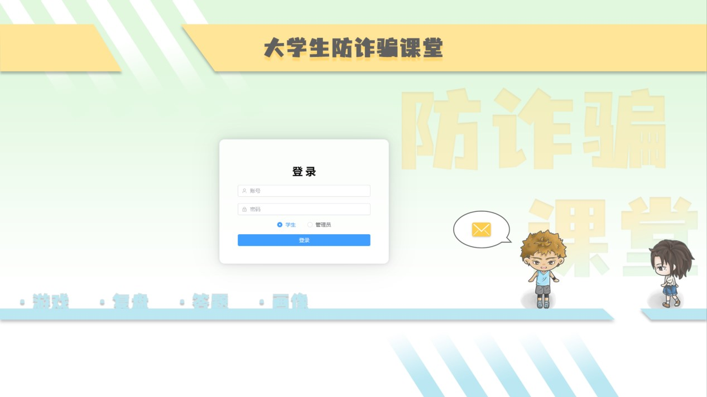
2. 进入页面 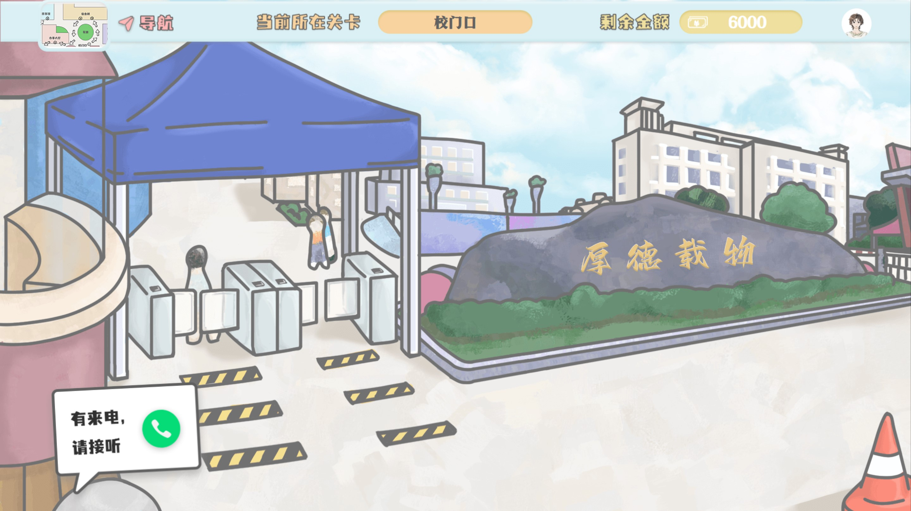
3. 场景探索 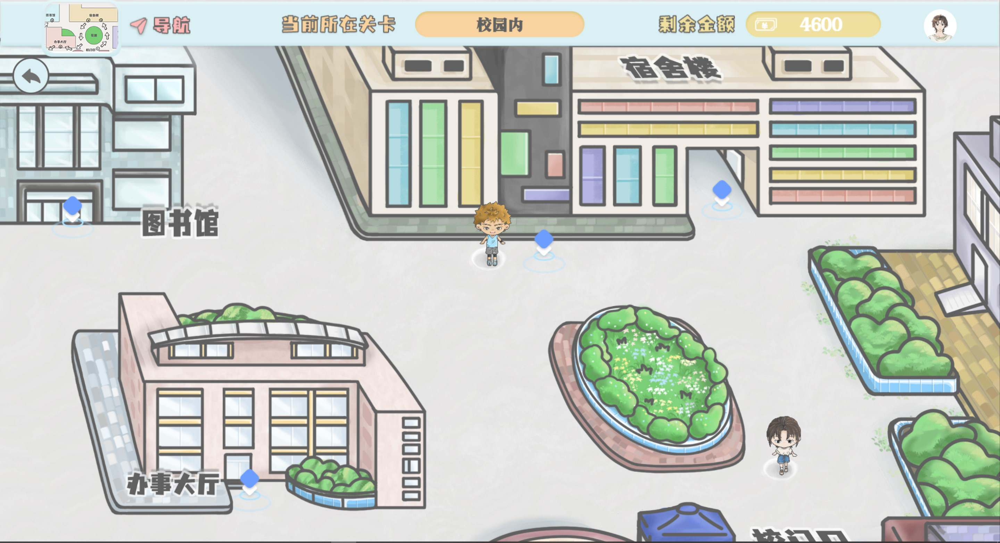
4. 场景3 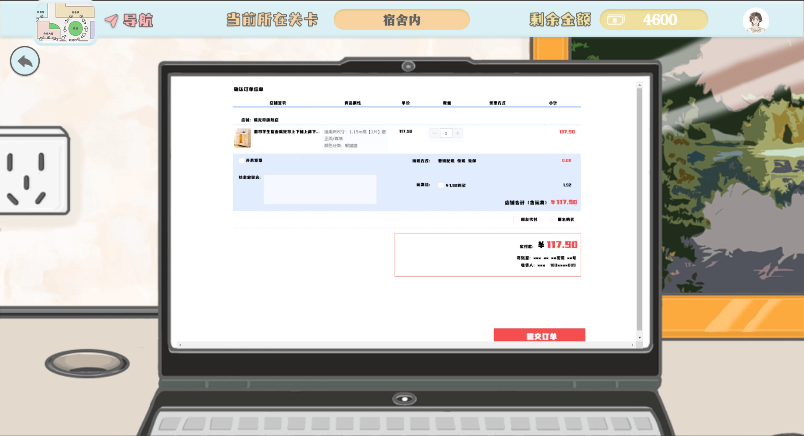
5. 复盘讲解 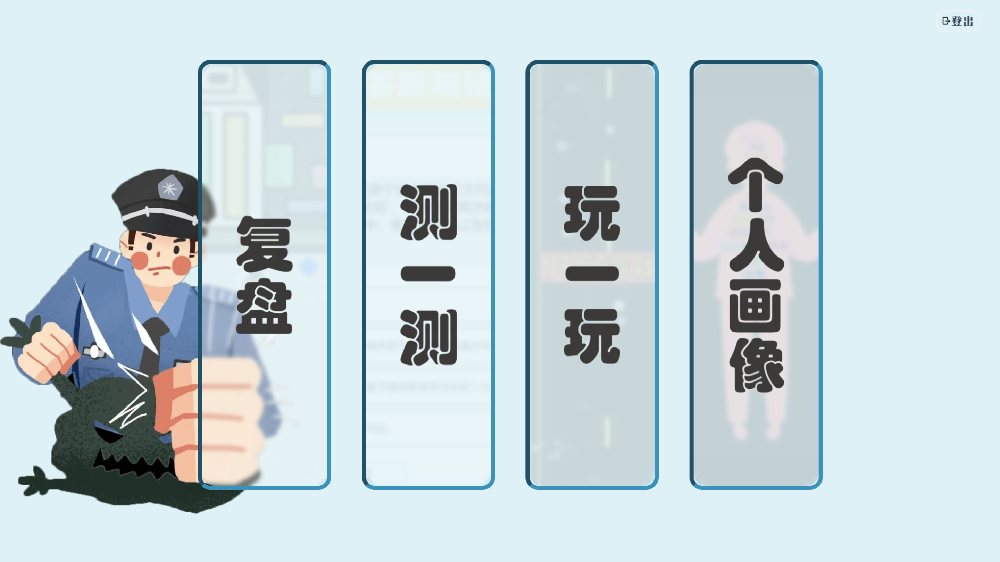
6. 复盘 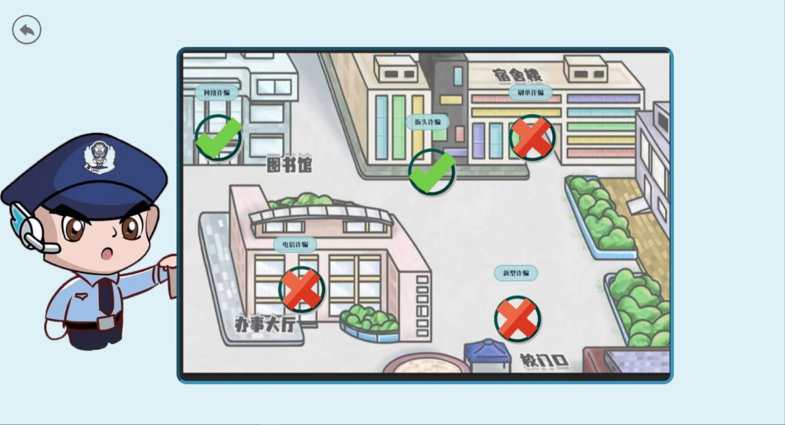
7. 视频讲解 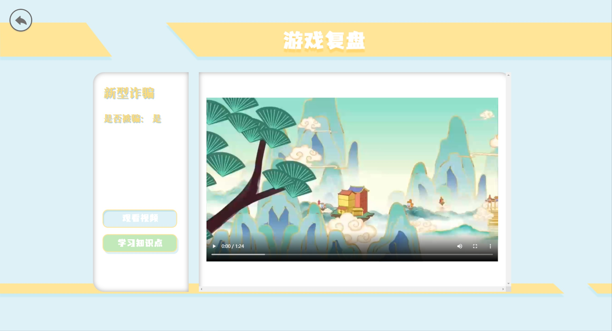
8. 答题测试 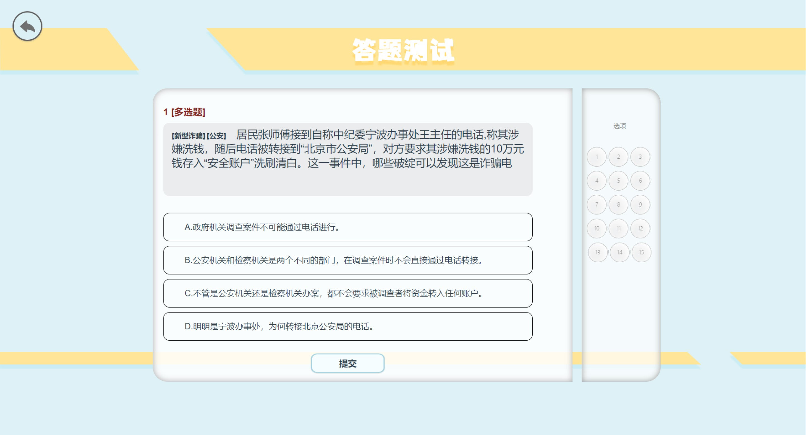
9. 游戏巩固 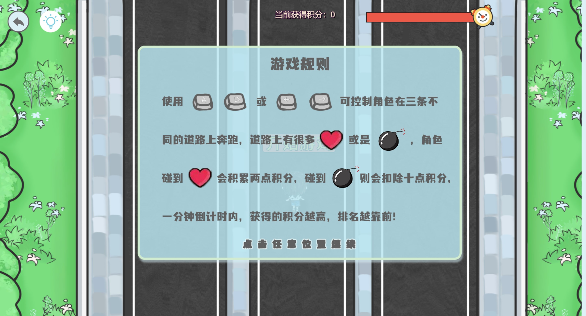
10. 用户画像 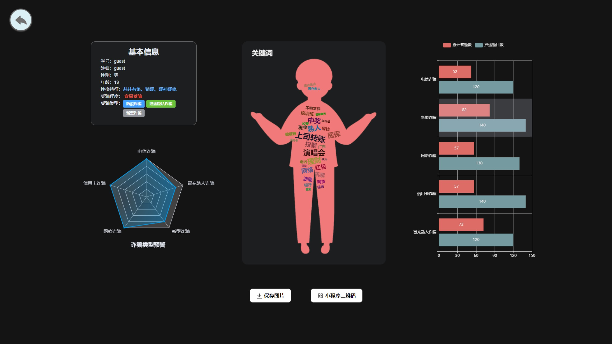
11. 微信小程序登录界面 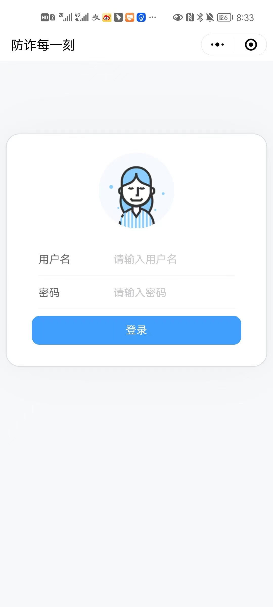
12. 微信小程序答题测试 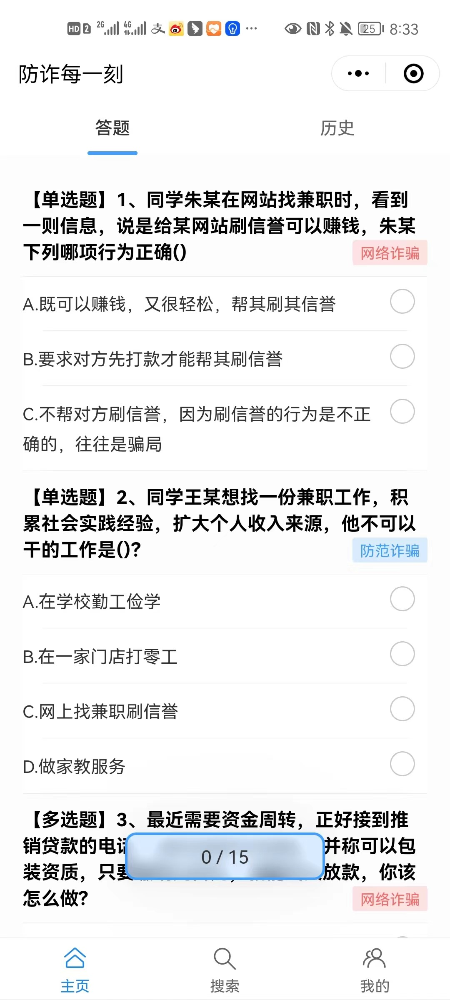
13. 后台管理系统概览界面 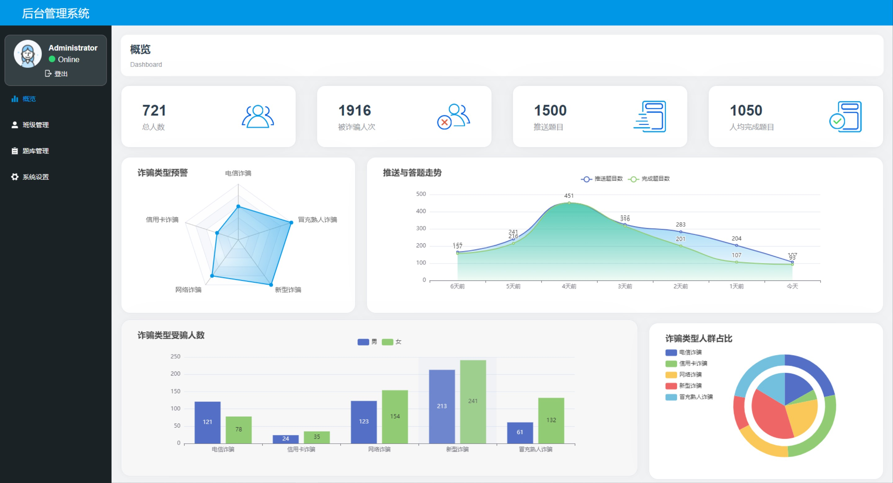
14. 后台管理系统题库管理界面 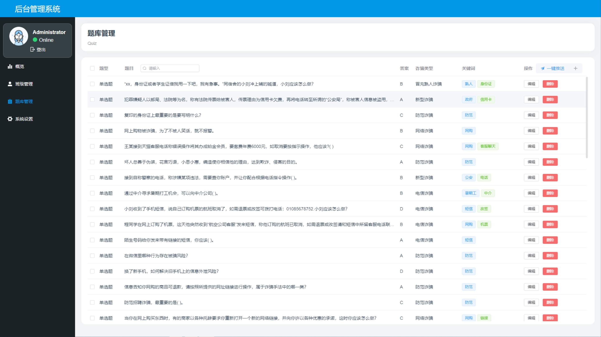
15. 后台管理系统班级管理界面 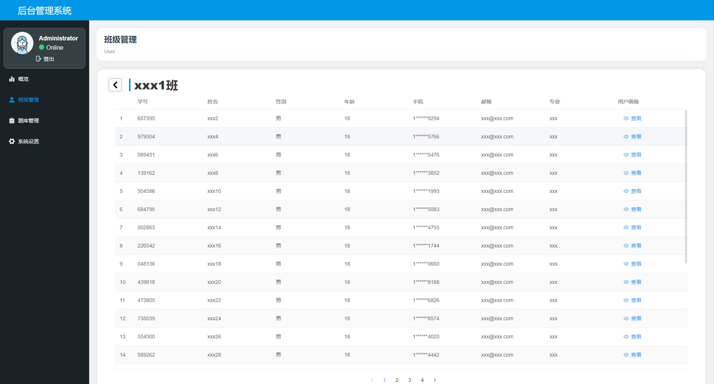
## 三、项目启动
### 前端（后台管理）
#### 本地启动
1. 安装node.js >=14
2. 安装依赖
```
npm install
npm run dev
```
#### 部署
1. 安装nginx
2. 安装node.js >=14
3. 使用命令打包 将打包好的dist文件夹放到nginx的html目录下 进行相关配置即可
```
npm run build
```

### 后端
#### 部署
```
java -jar xxx.jar
```
